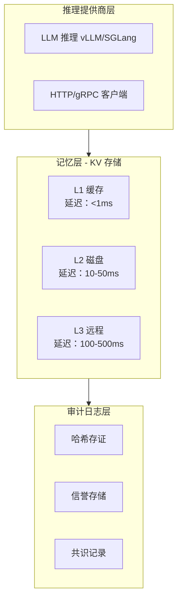

# 开发者指南 (Developer Guide)

> **项目定位**：分布式 KV 缓存系统 - 带哈希审计日志
>
> **适用对象**：贡献者、维护者、高级用户
>
> **最后更新**：2026-03-11
> **项目版本**：v0.5.0

---

## 目录

- [快速开始](#快速开始)
- [架构概览](#架构概览)
- [核心模块](#核心模块)
- [开发环境](#开发环境)
- [代码规范](#代码规范)
- [测试指南](#测试指南)
- [性能基准](#性能基准)
- [故障排查](#故障排查)
- [贡献流程](#贡献流程)

---

## 快速开始

### 环境要求

- **Rust**: 1.70+
- **Edition**: 2021
- **protoc**: 3.0+（gRPC 特性需要）

### 安装 protoc

```bash
# Debian/Ubuntu
apt-get install protobuf-compiler

# macOS
brew install protobuf

# Arch Linux
pacman -S protobuf

# Windows
# 下载 https://github.com/protocolbuffers/protobuf/releases
```

### 构建项目

```bash
# 克隆项目
git clone <repo>
cd block_chain_with_context

# 默认构建（包含 HTTP + gRPC + 多级缓存）
cargo build

# 启用全部特性
cargo build --features "rpc,grpc,tiered-storage,remote-storage"

# 运行测试
cargo test

# 运行示例
cargo run
```

### Feature 说明

```toml
[features]
# 默认启用：HTTP RPC + gRPC + 多级缓存
default = ["rpc", "grpc", "tiered-storage"]

# RPC 支持（HTTP）
rpc = ["axum", "tower", "tower-http"]

# gRPC 支持（跨节点通信）
grpc = ["tonic", "prost", "prost-types", "tonic-build"]

# 多级缓存支持（KV Cache 优化）
tiered-storage = ["bincode"]

# 远程存储支持（L3 Redis）
remote-storage = ["redis"]
```

---

## 架构概览

### 三层架构



### 组件职责

| 层级 | 核心定位 | 核心职责 | 关键约束 |
|------|----------|----------|----------|
| **推理提供商层** | 无状态计算单元 | 1. 从记忆层读取 KV<br>2. 执行 LLM 推理<br>3. 向记忆层写入新 KV<br>4. 上报推理指标 | 1. 无存储能力<br>2. 标准化接口 |
| **记忆层** | 分布式 KV 存储 | 1. KV Cache 存储<br>2. 哈希链式校验<br>3. 多副本存储<br>4. 版本控制/访问授权 | 1. 仅对接审计日志层<br>2. 热点数据本地缓存 |
| **审计日志层** | 存证与信誉管理 | 1. KV 哈希存证<br>2. 节点信誉管理<br>3. 共识结果记录 | 1. 轻量逻辑<br>2. 异步上链 |

### 依赖关系（单向依赖）

```text
推理提供商 → 依赖 → 记忆层（读取/写入 KV）
推理提供商 → 依赖 → 审计日志层（上报指标）
记忆层   → 依赖 → 审计日志层（哈希存证）
审计日志层 → 不依赖 → 推理提供商/记忆层
```

---

## 核心模块

### 模块结构

```
src/
├── lib.rs                      # 库入口，重新导出公共类型
├── error.rs                    # 统一错误类型（AppError）
├── concurrency.rs              # 并发工具（锁超时、锁顺序）
│
├── block.rs                    # 区块定义
├── blockchain.rs               # 审计日志核心实现
├── transaction.rs              # 交易定义
├── metadata.rs                 # 区块元数据
│
├── services/                   # 服务层（✅ 推荐）
│   ├── mod.rs
│   ├── inference_orchestrator.rs   # 推理编排服务
│   ├── commitment_service.rs       # 存证服务
│   └── failover_service.rs         # 故障切换服务
│
├── memory_layer.rs             # 记忆层管理
├── memory_layer/
│   ├── tiered_storage.rs       # 分层存储
│   ├── kv_chunk.rs             # Chunk-level 存储
│   ├── kv_index.rs             # Bloom Filter 索引
│   ├── async_storage.rs        # 异步存储后端
│   ├── kv_compressor.rs        # zstd 压缩
│   ├── prefetcher.rs           # 智能预取器
│   └── multi_level_cache.rs    # 多级缓存（L1+L2+L3）
│
├── node_layer.rs               # 节点管理层
├── node_layer/
│   └── rpc_server.rs           # HTTP RPC 服务器
│
├── provider_layer.rs           # 推理提供商层
├── provider_layer/
│   ├── llm_provider.rs         # 真实 LLM 提供商
│   └── http_client.rs          # HTTP 客户端
│
├── failover/
│   └── circuit_breaker.rs      # 断路器模式
│
├── consensus/
│   └── pbft.rs                 # PBFT 共识（原型）
│
├── gossip.rs                   # Gossip 同步协议（原型）
├── quality_assessment.rs       # 质量评估
├── reputation.rs               # 信誉系统
├── storage.rs                  # 持久化存储
└── utils.rs                    # 工具函数
```

### 模块职责

| 模块 | 职责 | 状态 |
|------|------|------|
| `services/` | 业务编排层，协调各层完成推理流程 | ✅ 生产就绪 |
| `blockchain.rs` | 审计日志核心，存证 KV 哈希 | ✅ 生产就绪 |
| `memory_layer/` | KV Cache 存储，支持分片/压缩/多级缓存 | ✅ 生产就绪 |
| `node_layer.rs` | 节点管理，信誉系统，访问控制 | ✅ 生产就绪 |
| `provider_layer.rs` | LLM 推理集成，HTTP 客户端 | ✅ 生产就绪 |
| `failover/` | 断路器，故障切换 | ✅ 生产就绪 |
| `consensus/` | PBFT 共识框架 | ⚠️ 原型 |
| `gossip.rs` | Gossip 同步协议 | ⚠️ 原型 |

---

## 开发环境

### 安装 Rust

```bash
# 使用 rustup 安装
curl --proto '=https' --tlsv1.2 -sSf https://sh.rustup.rs | sh
source $HOME/.cargo/env

# 验证安装
rustc --version
cargo --version
```

### 安装开发工具

```bash
# 安装 rustfmt（代码格式化）
rustup component add rustfmt

# 安装 clippy（代码检查）
rustup component add clippy

# 安装 cargo-audit（安全审计）
cargo install cargo-audit
```

### IDE 配置

#### VS Code

安装扩展：
- rust-analyzer
- crates
- Error Lens

配置 `settings.json`:
```json
{
  "rust-analyzer.cargo.features": "all",
  "rust-analyzer.checkOnSave.command": "clippy"
}
```

#### IntelliJ IDEA

安装插件：
- Rust
- Toml

### 预提交检查

```bash
# 格式化代码
cargo fmt

# 运行 clippy
cargo clippy --all-features --all-targets -- -D warnings

# 运行测试
cargo test --all-features

# 安全审计
cargo audit
```

---

## 代码规范

### 命名约定

```rust
// 类型：PascalCase
pub struct InferenceRequest;
pub enum TransactionType { Transfer, Stake, Vote }

// 函数和变量：snake_case
pub fn execute_inference(request: &InferenceRequest) -> Result<InferenceResponse>;
let provider_id = "provider_1";

// 常量：UPPER_SNAKE_CASE
pub const MAX_TRANSACTIONS_PER_BLOCK: usize = 1000;

// Trait：PascalCase
pub trait Hashable {
    fn hash(&self) -> String;
}
```

### 错误处理

```rust
// ✅ 推荐：使用统一错误类型
use block_chain_with_context::AppError;

pub fn read_kv(&self, key: &str) -> AppResult<KvShard> {
    self.cache.get(key)
        .ok_or_else(|| AppError::kv_not_found(key))
}

// ❌ 不推荐：避免 .map_err(|e| format!(...))
.map_err(|e| format!("Error: {}", e))
```

### 异步编程

```rust
// ✅ 推荐：使用 async/await
pub async fn execute_inference(
    &self,
    request: &InferenceRequest,
) -> AppResult<InferenceResponse> {
    let response = self.client
        .post(url)
        .json(request)
        .send()
        .await?;

    Ok(response.json().await?)
}

// ❌ 不推荐：避免 tokio::spawn 包同步 IO
tokio::spawn(async move {
    // 同步操作
});
```

### 线程安全

```rust
// ✅ 推荐：使用 Arc<RwLock<T>>
pub struct ArchitectureCoordinator {
    pub blockchain: Arc<RwLock<Blockchain>>,
    pub node_layer: Arc<NodeLayerManager>,
    pub memory_layer: Arc<MemoryLayerManager>,
}

// 访问时需要加锁
let mut bc = self.blockchain.write().unwrap();
bc.commit_inference(...);

// 或只读访问
let bc = self.blockchain.read().unwrap();
let owner = bc.owner_address();

// ❌ 不推荐：避免实现 Clone 导致深度克隆
impl Clone for Blockchain { ... }  // 移除！
```

### 并发安全（P11 锐评修复）

```rust
use block_chain_with_context::concurrency::{
    acquire_mutex_timeout, 
    acquire_rwlock_read_timeout,
    acquire_rwlock_write_timeout,
    LockOrder,
};

// 带超时的锁获取（避免死锁）
let guard = acquire_mutex_timeout(&mutex, 5000, "write operation").await?;

// 锁顺序检查（L1 → L2 → L3 → Blockchain → Memory）
LockOrder::L1.acquire(None);
LockOrder::L2.acquire(Some(LockOrder::L1)); // 有效
LockOrder::L1.acquire(Some(LockOrder::L2)); // 无效，可能死锁
```

### 配置管理（P11 锐评修复）

```rust
use block_chain_with_context::BlockchainConfig;

// ✅ 推荐：使用 Builder 模式
let config = BlockchainConfig::builder()
    .trust_threshold(0.75)
    .inference_timeout_ms(30000)
    .max_retries(5)
    .log_level("debug")
    .build()
    .expect("配置验证失败");

// ❌ 不推荐：旧方式（已废弃）
let config = BlockchainConfig::new(0.7);
```

### 文档注释

```rust
/// 推理请求 - QaaS 服务输入
///
/// # 参数
/// * `output` - LLM 生成的输出文本
/// * `context` - 可选的上下文文本
/// * `expected_kv_hash` - 期望的 KV 哈希（用于验证）
/// * `assessment_modes` - 评估模式列表
///
/// # 示例
/// ```
/// let request = QualityAssessmentRequest::new(
///     "Hello, AI!".to_string(),
///     Some("context".to_string()),
///     None,
///     vec![AssessmentMode::Semantic],
/// );
/// ```
#[derive(Debug, Clone)]
pub struct QualityAssessmentRequest {
    pub output: String,
    pub context: Option<String>,
    pub expected_kv_hash: Option<String>,
    pub assessment_modes: Vec<AssessmentMode>,
}
```

---

## 测试指南

### 测试分类

```bash
# 运行所有测试
cargo test

# 运行单元测试
cargo test --lib

# 运行集成测试
cargo test --test '*'

# 运行特定模块测试
cargo test --lib blockchain

# 运行并发测试
cargo test --test concurrency_tests -- --nocapture

# 运行模糊测试
cargo test --test fuzz_tests -- --nocapture

# 带输出运行测试
cargo test -- --nocapture

# 运行单个测试
cargo test --lib blockchain::tests::test_blockchain_creation
```

### 编写单元测试

```rust
#[cfg(test)]
mod tests {
    use super::*;

    #[test]
    fn test_basic_functionality() {
        // Arrange
        let blockchain = Blockchain::new("test".to_string());

        // Act
        blockchain.add_transaction(tx);

        // Assert
        assert_eq!(blockchain.chain.len(), 1);
    }

    #[tokio::test]
    async fn test_async_functionality() {
        // Arrange
        let manager = AsyncMemoryLayerManager::new("node_1");

        // Act
        manager.write_kv("key".to_string(), b"value".to_vec(), &cred).await.unwrap();

        // Assert
        let shard = manager.read_kv("key", &cred).await;
        assert!(shard.is_some());
    }
}
```

### 编写并发测试

```rust
#[tokio::test]
async fn test_100_threads_concurrent() {
    let blockchain = Arc::new(RwLock::new(Blockchain::new("test".to_string())));

    // 创建 100 个任务并发写入
    let handles: Vec<_> = (0..100)
        .map(|i| {
            let bc = blockchain.clone();
            tokio::spawn(async move {
                let mut bc = bc.write().await;
                bc.add_transaction(Transaction::new(...));
            })
        })
        .collect();

    // 等待所有任务完成
    for handle in handles {
        handle.await.unwrap();
    }

    // 验证
    let bc = blockchain.read().await;
    assert_eq!(bc.chain.len(), 101);  // 初始区块 + 100 个交易
}
```

### 编写属性测试（模糊测试）

```rust
use proptest::prelude::*;

proptest! {
    #[test]
    fn prop_hash_consistency(data in any::<Vec<u8>>()) {
        let hash1 = compute_hash(&data);
        let hash2 = compute_hash(&data);

        // 相同数据产生相同哈希
        assert_eq!(hash1, hash2);
    }

    #[test]
    fn prop_hash_uniqueness(data1: Vec<u8>, data2: Vec<u8>) {
        prop_assume!(data1 != data2);

        let hash1 = compute_hash(&data1);
        let hash2 = compute_hash(&data2);

        // 不同数据产生不同哈希（概率极高）
        prop_assert_ne!(hash1, hash2);
    }
}
```

---

## 性能基准

### 运行基准测试

```bash
# 运行基准测试（需要 nightly）
cargo +nightly bench

# 运行特定基准
cargo +nightly bench --bench performance_bench
```

### 性能指标

#### KV 操作延迟

| 操作 | L1 命中 | L2 命中 | L3 命中 |
|------|--------|--------|--------|
| 读取延迟 | < 1ms | 10-50ms | 100-500ms |
| 写入延迟 | < 1ms | 10-50ms | 100-500ms |
| 成本/GB | $0.05 | $0.01 | $0.001 |

#### 并发性能

| 测试场景 | 线程数 | 吞吐量 | P99 延迟 |
|---------|--------|--------|---------|
| KV 并发写入 | 10 | ~10K ops/s | ~5ms |
| KV 并发写入 | 100 | ~50K ops/s | ~20ms |
| 审计日志读取 | 10 | ~100K ops/s | ~1ms |

**数据来源**：`benches/performance_bench.rs`

---

## 故障排查

### 常见问题

#### 1. protoc 未找到

```text
❌ ERROR: protoc (protobuf compiler) not found
   gRPC feature requires protobuf-compiler to build.
```

**解决方案**:
```bash
# Debian/Ubuntu
apt-get install protobuf-compiler

# macOS
brew install protobuf

# 或禁用 gRPC 特性
cargo build --no-default-features --features rpc
```

#### 2. 编译警告错误

```text
error: unused variable: `x`
```

**解决方案**:
```bash
# 运行 clippy 查看详细信息
cargo clippy --all-features --all-targets -- -D warnings

# 修复警告或添加允许
#[allow(unused_variables)]
```

#### 3. 测试失败

```text
test result: FAILED. 125 passed; 3 failed
```

**解决方案**:
```bash
# 带输出运行失败测试
cargo test -- --nocapture

# 运行单个失败测试
cargo test --lib specific_test_name -- --nocapture
```

#### 4. 线程死锁

```text
thread 'main' panicked at 'called `Result::unwrap()` on an `Err` value: PoisonError { .. }'
```

**解决方案**:
- 检查 `RwLock` 使用是否正确
- 避免在持有锁时执行耗时操作
- 使用带超时的锁获取方法：
  ```rust
  use block_chain_with_context::concurrency::acquire_mutex_timeout;
  
  let guard = acquire_mutex_timeout(&mutex, 5000, "operation").await?;
  ```

### 调试技巧

```rust
// 启用日志
use tracing::{info, debug, error};

#[tokio::main]
async fn main() {
    tracing_subscriber::fmt::init();

    info!("Starting application");
    debug!("Debug info: {:?}", some_data);

    // ...
}
```

```bash
# 设置日志级别
RUST_LOG=debug cargo run

# 设置特定模块日志级别
RUST_LOG=block_chain_with_context::blockchain=debug cargo run
```

---

## 贡献流程

### 1. Fork 项目

```bash
# Fork 项目
gh repo fork <repo>

# 克隆到本地
git clone <your-fork>
cd block_chain_with_context
```

### 2. 创建分支

```bash
# 创建功能分支
git checkout -b feature/your-feature-name

# 或修复分支
git checkout -b fix/issue-123
```

### 3. 开发和测试

```bash
# 编写代码
# ...

# 格式化
cargo fmt

# 运行 clippy
cargo clippy --all-features --all-targets -- -D warnings

# 运行测试
cargo test --all-features

# 提交更改
git add .
git commit -m "feat: add your feature description"
```

### 4. 提交 PR

```bash
# 推送到远程
git push origin feature/your-feature-name

# 创建 PR
gh pr create \
  --title "feat: your feature description" \
  --body "## Description\n\nDescribe your changes\n\n## Related Issues\n\nCloses #123"
```

### 5. Code Review

- 等待维护者审查
- 根据反馈修改代码
- 通过 CI 检查
- 合并到主分支

---

## 相关文档

- [架构文档](ARCHITECTURE.md) - 系统架构、数据流、监控
- [P11 锐评与修复](P11_REVIEW.md) - 业内专家锐评及修复记录
- [修复总结](REMEDIATION_SUMMARY.md) - 修复进度总结
- [生产就绪度说明](limitations.md) - 生产环境适用性说明
- [变更日志](CHANGELOG.md) - 版本更新历史

---

*最后更新：2026-03-11*
*项目版本：v0.5.0*
