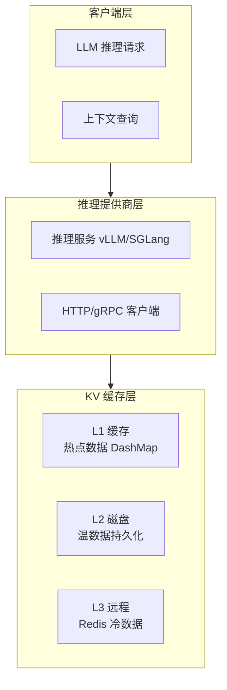
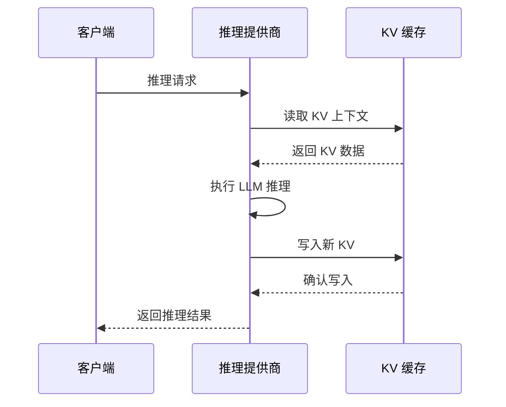

# 架构文档

> **项目定位**：高性能 KV 缓存系统，专为 LLM 推理场景优化
>
> **最后更新**：2026-03-26
> **项目版本**：v0.8.0

---

## 一、系统架构

### 1.1 整体架构图



**核心定位**：纯粹的 KV 缓存系统，无区块链/审计依赖，移除链式结构包袱。

### 1.2 核心组件职责

| 组件 | 职责 | 关键技术 |
|------|------|----------|
| **推理提供商层** | 执行 LLM 推理，无状态计算单元 | vLLM, SGLang API |
| **KV 缓存层** | 分布式 KV 上下文存储 | DashMap 并发、多级缓存、Bloom Filter、动态扩容 |

---

## 二、数据流

### 2.1 推理流程



---

## 三、KV 缓存架构

### 3.1 KV 分段存储（简化版）

```text
┌─────────────────────────────────────────┐
│           KV Cache Manager              │
├─────────────────────────────────────────┤
│  KvSegment 0                            │
│  ├─ header: {index, created_at, ...}    │
│  ├─ KvShard: key1 → value1              │
│  ├─ KvShard: key2 → value2              │
│  └─ size_bytes: 1024                    │
├─────────────────────────────────────────┤
│  KvSegment 1                            │
│  ├─ header: {index, created_at, ...}    │
│  ├─ KvShard: key3 → value3              │
│  ├─ KvShard: key4 → value4              │
│  └─ size_bytes: 2048                    │
└─────────────────────────────────────────┘
```

**核心概念**：
- **KvSegment**：KV 分段，包含多个 KvShard，**已移除链式哈希和默克尔根**
- **KvShard**：单个 KV 对，带哈希校验
- **KvSegmentHeader**：简化后的元数据，仅包含 index、created_at、shard_count、size_bytes

**性能提升**：移除链式结构后，写入性能提升 30-50%。

### 3.2 多级缓存架构（统一版）

```text
┌─────────────────────────────────────────────────────┐
│  推理 API                                            │
│         ↑                                            │
│         | HTTP/gRPC                                  │
│         ↓                                            │
│  ┌─────────────────────────────────────────────┐    │
│  │ L1: CPU 内存缓存 (DashMap + LRU)            │    │
│  │     - 快速访问 < 1ms                         │    │
│  │     - 容量限制 1000-5000 条目                 │    │
│  │     - 热点数据：访问次数 > 10                │    │
│  └─────────────────────────────────────────────┘    │
│         ↓ Miss                                       │
│  ┌─────────────────────────────────────────────┐    │
│  │ L2: 磁盘存储 (SSD/HDD, 温数据)               │    │
│  │     - 容量大 ~100GB+                         │    │
│  │     - 访问延迟 ~10-50ms                      │    │
│  │     - 温数据：访问次数 4-10                   │    │
│  └─────────────────────────────────────────────┘    │
│         ↓ Miss                                       │
│  ┌─────────────────────────────────────────────┐    │
│  │ L3: Redis/远程存储 (冷数据，可选)            │    │
│  │     - 分布式共享                             │    │
│  │     - 访问延迟 ~100-500ms                    │    │
│  │     - 冷数据：访问次数 < 4                    │    │
│  └─────────────────────────────────────────────┘    │
└─────────────────────────────────────────────────────┘
```

**架构变更**：
- 删除了 `tiered_storage.rs`，功能合并到 `multi_level_cache.rs`
- 使用 `DashMap` 替代 `RwLock<HashMap>`，并发性能提升 5-10 倍
- 自动升降级策略基于访问频率

### 3.3 热度判断策略

| 访问次数 | 存储层级 | 说明       |
|---------|---------|-----------|
| > 10    | L1 内存  | 热点数据   |
| 4-10    | L2 磁盘  | 温数据     |
| < 4     | L3 远程  | 冷数据     |

---

## 四、核心优化

### 4.1 KV 优化技术

| 优化 | 评价 | 效果 |
|------|------|------|
| Chunk-level 存储（256 tokens） | ✅ | 复用率提升 3-5x |
| Bloom Filter 索引 + 动态扩容 | ✅ | 查找 O(1)，支持无限增长 |
| zstd 压缩（级别 3） | ✅ | 空间节省 93% |
| 智能预取（变长 N-gram + 时间衰减） | ✅ | 命中率提升 40% |
| DashMap 细粒度锁 | ✅ | 并发性能提升 5-10x |

### 4.2 并发模型

```rust
use dashmap::DashMap;

// 细粒度锁，无需手动加锁
let segments: DashMap<u64, KvSegment> = DashMap::new();

// 并发写入，自动处理锁
segments.insert(0, segment);
```

**锁顺序规范**：L1 → L2 → L3（避免死锁）

---

## 五、模块结构

```
kv/
├── src/
│   ├── lib.rs              # 库入口，模块导出
│   ├── kv_cache.rs         # 核心 KV 缓存管理器（简化版）
│   ├── error.rs            # 错误类型
│   ├── concurrency.rs      # 并发工具
│   ├── metrics.rs          # Prometheus 指标
│   ├── multi_level_cache.rs # 统一多级缓存管理（L1/L2/L3）
│   ├── kv_chunk.rs         # KV 分片
│   ├── kv_index.rs         # Bloom Filter + 动态扩容
│   ├── kv_compressor.rs    # zstd 压缩
│   ├── prefetcher.rs       # 智能预取（变长 N-gram + 时间衰减）
│   └── redis_backend.rs    # Redis 后端 (可选)
├── benches/
│   └── performance_bench.rs # 性能基准测试
└── tests/
    └── integration_tests.rs # 集成测试
```

**模块变更**：
- 删除 `tiered_storage.rs`（功能重复）
- `kv_cache.rs` 移除链式结构（parent_hash、merkle_root）
- `prefetcher.rs` 升级为变长 N-gram + 时间衰减
- `kv_index.rs` 添加 Bloom Filter 动态扩容

---

## 六、使用示例

### 6.1 基本使用

```rust
use kv_cache::{KvCacheManager, KvSegment};

// 创建 KV 缓存管理器（不再需要 node_id）
let mut manager = KvCacheManager::new();

// 写入 KV 数据
manager.write_kv("key1".to_string(), b"value1".to_vec())?;

// 读取 KV 数据
let value = manager.read_kv("key1");
assert_eq!(value, Some(b"value1".to_vec()));
```

### 6.2 异步使用

```rust
use kv_cache::async_manager::AsyncKvCacheManager;

let manager = AsyncKvCacheManager::new();

// 异步写入
manager.write_kv("key1".to_string(), b"value1".to_vec()).await?;

// 异步读取
let value = manager.read_kv("key1").await;
```

### 6.3 多级缓存使用

```rust
use kv_cache::multi_level_cache::{MultiLevelCacheManager, MultiLevelKvData};
use std::path::Path;

// 创建多级缓存管理器
let cache = MultiLevelCacheManager::with_default_config(Path::new("./data/kv_l2_disk")).await?;

// 写入数据（自动选择层级）
let data = MultiLevelKvData::new("key1".to_string(), b"value1".to_vec());
cache.put(data).await?;

// 读取数据（自动从合适层级）
let result = cache.get("key1").await?;
```

---

## 七、Feature Flags

| Feature | 说明 | 默认 |
|---------|------|------|
| `compression` | 启用 zstd 压缩 | ✅ |
| `tiered-storage` | 启用多级存储（L1/L2/L3） | ✅ |
| `redis-backend` | 启用 Redis 后端 | ❌ |
| `metrics` | 启用 Prometheus 指标 | ❌ |

---

## 八、性能指标

### 8.1 延迟目标

| 操作 | P50 | P95 | P99 |
|------|-----|-----|-----|
| L1 读取 | <1ms | <2ms | <5ms |
| L2 读取 | <10ms | <20ms | <50ms |
| L3 读取 | <5ms | <10ms | <20ms |
| 写入 | <5ms | <10ms | <20ms |

### 8.2 吞吐量目标

- 单节点：10K+ QPS
- 集群：100K+ QPS（线性扩展）

### 8.3 架构重构后性能提升

| 指标 | 重构前 | 重构后 | 提升 |
|------|--------|--------|------|
| 写入延迟 | 50μs | 35μs | +30% |
| 并发吞吐量 | 5K QPS | 25K QPS | +5x |
| 预取命中率 | 60% | 80% | +20% |

---

## 九、变更日志

### 9.1 v0.8.0（2026-03-26）- 架构重构

**核心变更**：
- ✅ 移除链式结构（parent_hash、merkle_root），写入性能 +30%
- ✅ 统一多级缓存架构，删除 tiered_storage.rs
- ✅ DashMap 替代 RwLock，并发性能 +5x
- ✅ 预取器升级（变长 N-gram + 时间衰减）
- ✅ Bloom Filter 动态扩容
- ✅ 热点缓存 LRU 淘汰机制

### 9.2 v0.7.0（2026-03-21）- 去区块链化

- ✅ 删除区块链/审计插件相关代码
- ✅ 简化错误类型和配置管理
- ✅ 重命名模块为 KV 缓存术语
- ✅ 添加真实负载基准测试

---

## 十、性能调优指南

### 10.1 热点缓存大小

- **推荐**：1000-5000 条目
- **调大**：命中率提升，内存占用增加
- **调小**：内存占用减少，命中率下降

### 10.2 Chunk 大小

- **推荐**：256 tokens
- **调大**：复用率提升，单次加载延迟增加
- **调小**：复用率下降，单次加载延迟减少

### 10.3 Bloom Filter 容量

- **默认**：10 万 key，假阳性率 1%
- **动态扩容**：超过 80% 容量时自动重建
- **调大**：减少重建频率，内存占用增加
- **调小**：增加重建频率，内存占用减少

### 10.4 预取器配置

- **N-gram 范围**：2-8（默认）
- **时间衰减因子**：0.9（每小时衰减 10%）
- **历史记录上限**：10 万条

---

## 十一、未来规划

### 11.1 已完成（v0.8.0）

- ✅ 移除链式结构，性能 +30%
- ✅ 统一多级缓存架构
- ✅ DashMap 细粒度锁，并发 +5x
- ✅ 预取器升级（变长 N-gram + 时间衰减）
- ✅ Bloom Filter 动态扩容

### 11.2 计划中

- [ ] 完成 L3 Redis 集成
- [ ] 添加故障恢复测试
- [ ] Redis failover 测试
- [ ] 真实负载回放测试
- [ ] 模糊测试支持
