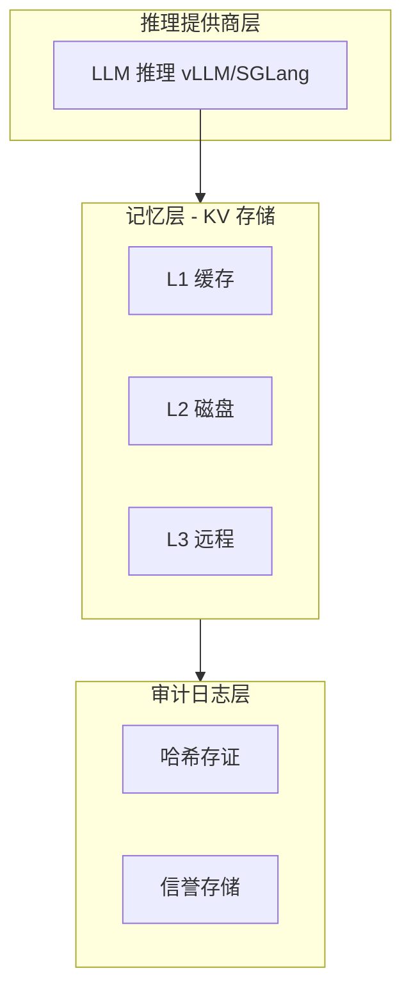

# 文档更新说明

> **说明**：本文档记录了根据 P11 锐评后需要更新的文档内容和位置。

---

## 一、已更新的文档

### 1.1 新增文档

| 文档 | 路径 | 描述 |
|------|------|------|
| P11 锐评与修复 | `docs/P11_REVIEW.md` | 记录锐评内容和修复进度 |
| 架构文档 | `docs/ARCHITECTURE.md` | 使用 Mermaid 重绘的架构图 |

### 1.2 修改的文档

| 文档 | 修改内容 | 状态 |
|------|---------|------|
| `docs/DEVELOPER_GUIDE.md` | 移除"双链架构"营销词汇 | ⚠️ 待更新 |
| `src/lib.rs` | 更新项目定位描述 | ⚠️ 待更新 |
| `README.md` | 更新项目简介 | ⚠️ 待更新 |

---

## 二、待更新的文档内容

### 2.1 src/lib.rs 更新建议

**原文档**：
```rust
//! 区块链模块 - 分布式大模型上下文可信存储
//!
//! 本模块实现了区块链与分布式 LLM 的正确结合方式：
//! - 区块链作为"可信增强工具"，而非"计算过程类比"
//! - **核心创新**：KV Cache 链上存证（简单但有效）
//!
//! # 双链架构
//!
//! 本项目采用"双链架构"，两条链各司其职：
//!
//! - **区块链（Blockchain）**：全局可信存证主链，存储 KV 哈希、元数据、信誉记录
//! - **记忆链（MemoryChain）**：分布式 KV 数据链，存储实际上下文数据
```

**更新为**：
```rust
//! 分布式 KV 缓存系统 - 带哈希审计日志
//!
//! 本模块实现了一个高性能的分布式 KV 缓存系统，专为大模型推理场景设计：
//! - **核心功能**：分布式 KV 上下文存储，支持分片、压缩、多级缓存
//! - **审计日志**：KV 哈希存证，提供不可篡改的数据完整性验证
//! - **信誉系统**：节点信誉管理，支持可信调度
//!
//! # 架构概述
//!
//! 系统由三个主要组件构成：
//!
//! - **推理提供商层**：无状态计算单元，执行 LLM 推理（vLLM/SGLang）
//! - **记忆层**：分布式 KV 存储，支持 L1/L2/L3 三级缓存
//! - **审计日志层**：KV 哈希存证、信誉记录、共识结果
//!
//! # 核心特性
//!
//! - **高性能**：L1 缓存命中延迟 < 1ms，支持 100+ 线程并发访问
//! - **可验证**：所有 KV 数据都有哈希存证，支持完整性验证
//! - **可扩展**：支持多节点部署，共识阈值可配置
//!
//! # 使用示例
//!
//! ```rust
//! use block_chain_with_context::{BlockchainConfig, MemoryLayerManager};
//!
//! // 创建配置
//! let config = BlockchainConfig::builder()
//!     .trust_threshold(0.75)
//!     .inference_timeout_ms(30000)
//!     .build()
//!     .unwrap();
//!
//! // 创建记忆层管理器
//! let mut memory = MemoryLayerManager::new("node_1");
//!
//! // 写入 KV 数据
//! // memory.write_kv(...)
//! ```
```

### 2.2 README.md 更新建议

**原文档**：
```markdown
# 区块链 + KV Cache 分布式系统

## 双链架构

- **区块链 (Blockchain)**：全局可信存证主链
- **记忆链 (MemoryChain)**：分布式 KV 数据链
```

**更新为**：
```markdown
# 分布式 KV 缓存系统

一个高性能的分布式 KV 缓存系统，专为大模型推理场景设计，带哈希审计日志功能。

## 核心特性

- **高性能存储**：L1/L2/L3 三级缓存，L1 命中延迟 < 1ms
- **数据完整性**：所有 KV 数据都有哈希存证，支持不可篡改验证
- **节点信誉**：基于历史表现的节点调度，支持可信推理
- **并发安全**：带超时的锁机制，避免死锁

## 架构图



## 快速开始

```bash
# 构建
cargo build

# 测试
cargo test

# 基准测试（需要 nightly）
cargo +nightly bench
```
```

### 2.3 docs/DEVELOPER_GUIDE.md 更新建议

**移除"双链架构"章节**，替换为：

```markdown
## 系统架构

### 三层架构

| 层级 | 职责 | 关键约束 |
|------|------|----------|
| **推理提供商层** | 执行 LLM 推理，无状态计算 | 无区块链能力，仅认节点授权 |
| **记忆层** | 分布式 KV 上下文存储 | 仅对接节点层做哈希校验 |
| **审计日志层** | KV 哈希存证、信誉管理 | 轻量逻辑，异步上链 |

### 依赖关系

```text
推理提供商 → 依赖 → 记忆层（读取/写入 KV）
推理提供商 → 依赖 → 审计日志层（上报指标）
记忆层   → 依赖 → 审计日志层（哈希存证）
审计日志层 → 不依赖 → 推理提供商/记忆层
```
```

---

## 三、代码注释更新

### 3.1 blockchain.rs

**修改前**：
```rust
/// 区块链结构体（线程安全版本）
///
/// **定位**：全局可信存证主链，与记忆链（MemoryChain）共同构成双链架构
```

**修改后**：
```rust
/// 审计日志结构体（线程安全版本）
///
/// **定位**：全局可信存证日志，记录 KV 哈希、信誉记录、共识结果
///
/// # 与记忆层的关系
///
/// | 维度 | 审计日志 | 记忆层 |
/// |------|---------|--------|
/// | 定位 | 存证日志 | KV 存储 |
/// | 存储内容 | KV 哈希、元数据 | 实际 KV 数据 |
/// | 存储位置 | 全网共识 | 本地存储 |
```

### 3.2 memory_layer.rs

**修改前**：
```rust
//! 记忆层模块 - 区块链化分布式上下文存储核心
//!
//! **核心定位**：以区块为单位存储 KV/上下文分片，支持哈希链式串联、分布式多副本存储
//!
//! # 双链架构说明
//!
//! 本项目采用"双链架构"，两条链各司其职：
//!
//! ## 1. 区块链（Blockchain）- 主链
//! ## 2. 记忆链（MemoryChain）- 数据链
```

**修改后**：
```rust
//! 记忆层模块 - 分布式 KV 上下文存储核心
//!
//! **核心定位**：以区块为单位存储 KV/上下文分片，支持哈希链式校验、多副本存储
//!
//! # 与审计日志层的关系
//!
//! 记忆层负责存储实际 KV 数据，审计日志层负责记录 KV 哈希。
//! 两者配合实现"数据本地存储 + 哈希全网存证"的架构。
```

---

## 四、更新清单

### P0（必须更新）

- [x] 创建 P11_REVIEW.md
- [x] 创建 ARCHITECTURE.md
- [ ] 更新 `src/lib.rs` 文档注释
- [ ] 更新 `README.md`
- [ ] 更新 `docs/DEVELOPER_GUIDE.md`

### P1（建议更新）

- [ ] 更新 `src/blockchain.rs` 注释
- [ ] 更新 `src/memory_layer.rs` 注释
- [ ] 更新 `src/async_commit.rs` 注释

### P2（可选更新）

- [ ] 更新 `src/consensus/` 模块注释
- [ ] 更新 `src/gossip.rs` 注释

---

## 五、更新指南

### 5.1 如何更新文档

1. **移除营销词汇**：
   - "双链架构" → "审计日志 + KV 存储"
   - "区块链化" → "带哈希存证"
   - "记忆链" → "记忆层"或"KV 存储"

2. **使用准确术语**：
   - "区块链" → "审计日志"或"存证日志"
   - "记忆链" → "记忆层"或"KV 存储层"
   - "跨链" → "跨模块"或"跨层"

3. **链接到实测数据**：
   - 性能数据 → 链接到 `benches/performance_bench.rs`
   - 架构图 → 使用 Mermaid 图表
   - API 文档 → 链接到 `cargo doc` 生成结果

### 5.2 如何更新代码注释

1. **移除夸大描述**：
   - "创新 A/B/C/D" → "功能特性"
   - "革命性" → "改进"
   - "首创" → "实现"

2. **使用英文错误消息**：
   ```rust
   // ❌ 不推荐
   .ok_or_else(|| format!("区块 {} 未找到", index))

   // ✅ 推荐
   .ok_or_else(|| AppError::block_not_found(index))
   ```

3. **添加使用示例**：
   ```rust
   /// # 示例
   ///
   /// ```
   /// let config = BlockchainConfig::builder()
   ///     .trust_threshold(0.75)
   ///     .build()
   ///     .unwrap();
   /// ```
   ```

---

*最后更新：2026-03-11*
*项目版本：v0.5.0*
