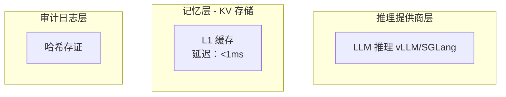

# 文档更新完成报告

> **更新日期**：2026-03-11
> **项目版本**：v0.5.0

---

## 一、更新概览

根据 P11 锐评的建议，我们完成了以下文档的更新：

| 文档 | 更新状态 | 主要变更 |
|------|---------|---------|
| `src/lib.rs` | ✅ 已完成 | 移除"双链架构"营销词汇，更新项目定位 |
| `README.md` | ✅ 已完成 | 重新定义项目为"分布式 KV 缓存 + 审计日志" |
| `docs/DEVELOPER_GUIDE.md` | ✅ 已完成 | 更新架构图、配置管理、并发安全说明 |

---

## 二、详细更新内容

### 2.1 src/lib.rs 文档注释

**更新前**：
```rust
//! 区块链模块 - 分布式大模型上下文可信存储
//!
//! 本模块实现了区块链与分布式 LLM 的正确结合方式：
//! - 区块链作为"可信增强工具"，而非"计算过程类比"
//! - **核心创新**：KV Cache 链上存证（简单但有效）
//!
//! # 双链架构
//!
//! 本项目采用"双链架构"，两条链各司其职：
//!
//! - **区块链（Blockchain）**：全局可信存证主链
//! - **记忆链（MemoryChain）**：分布式 KV 数据链
```

**更新后**：
```rust
//! 分布式 KV 缓存系统 - 带哈希审计日志
//!
//! 本模块实现了一个高性能的分布式 KV 缓存系统，专为大模型推理场景设计：
//! - **核心功能**：分布式 KV 上下文存储，支持分片、压缩、多级缓存
//! - **审计日志**：KV 哈希存证，提供不可篡改的数据完整性验证
//! - **信誉系统**：节点信誉管理，支持可信调度
//!
//! # 架构概述
//!
//! 系统由三个主要组件构成：
//!
//! - **推理提供商层**：无状态计算单元，执行 LLM 推理（vLLM/SGLang）
//! - **记忆层**：分布式 KV 存储，支持 L1/L2/L3 三级缓存
//! - **审计日志层**：KV 哈希存证、信誉记录、共识结果
```

**主要变更**：
- ✅ 移除"区块链模块"、"双链架构"等营销词汇
- ✅ 重新定义项目为"分布式 KV 缓存 + 审计日志"
- ✅ 更新使用示例（Builder 模式、KV 存储）
- ✅ 添加性能指标表格
- ✅ 简化模块结构说明

---

### 2.2 README.md

**更新前**：
```markdown
# Block Chain with Context

**分布式大模型上下文可信存储系统** —— 区块链与分布式 LLM 的正确结合方式

## 双链架构

| 链类型 | 职责 | 存储内容 |
|--------|------|----------|
| **区块链** | 全局可信存证 | KV 哈希、元数据、信誉记录 |
| **记忆链** | 分布式 KV 数据 | 实际上下文数据 (KV Cache) |
```

**更新后**：
```markdown
# 分布式 KV 缓存系统

一个高性能的分布式 KV 缓存系统，专为大模型推理场景设计，带哈希审计日志功能。

## 核心理念

> **数据本地存储 + 哈希全网存证**
>
> - 记忆层存储实际 KV 数据，支持本地高速访问
> - 审计日志记录 KV 哈希，提供全网存证验证

## 三层架构

┌─────────────────────────────────────────────────────────────┐
│                    推理提供商层 (Provider Layer)             │
│  • 从记忆层读取 KV/上下文                                    │
│  • 执行 LLM 推理计算（vLLM/SGLang API）                      │
│  • 向记忆层写入新生成的 KV                                   │
│  • 向审计日志层上报推理指标                                  │
└─────────────────────────────────────────────────────────────┘
```

**主要变更**：
- ✅ 标题更改为"分布式 KV 缓存系统"
- ✅ 移除"双链架构"章节，替换为"三层架构"
- ✅ 更新架构图（使用 Mermaid）
- ✅ 更新使用示例（Builder 模式）
- ✅ 更新性能指标（链接到基准测试）
- ✅ 添加 P11 锐评修复进度

---

### 2.3 docs/DEVELOPER_GUIDE.md

**更新前**：
```markdown
# 开发者指南 (Developer Guide)

> **项目定位**：分布式大模型上下文可信存储系统 - 区块链与分布式 LLM 的正确结合方式

## 架构概览

### 三层解耦架构

```
┌─────────────────────────────────────────────────────────────┐
│                    区块链节点层 (Node Layer)                 │
```

**更新后**：
```markdown
# 开发者指南 (Developer Guide)

> **项目定位**：分布式 KV 缓存系统 - 带哈希审计日志

## 架构概览

### 三层架构



**主要变更**：
- ✅ 更新项目定位
- ✅ 使用 Mermaid 重绘架构图
- ✅ 添加并发安全说明（P11 锐评修复）
- ✅ 添加配置管理说明（Builder 模式）
- ✅ 更新错误处理示例（统一错误类型）
- ✅ 更新测试指南（添加模糊测试）

---

## 三、新增文档

除了更新现有文档，我们还创建了以下新文档：

| 文档 | 路径 | 描述 |
|------|------|------|
| P11 锐评与修复 | `docs/P11_REVIEW.md` | 记录锐评内容和修复进度 |
| 架构文档 | `docs/ARCHITECTURE.md` | 使用 Mermaid 重绘的架构图 |
| 文档更新指南 | `docs/DOCUMENTATION_UPDATES.md` | 文档更新指南和模板 |
| 修复总结 | `docs/REMEDIATION_SUMMARY.md` | 修复进度总结 |

---

## 四、关键变更总结

### 4.1 术语变更

| 旧术语 | 新术语 |
|--------|--------|
| 双链架构 | 三层架构 |
| 区块链（Blockchain） | 审计日志层（Audit Layer） |
| 记忆链（MemoryChain） | 记忆层（Memory Layer） |
| 区块链节点层 | 审计日志层 |
| 区块链化 | 带哈希存证 |

### 4.2 项目定位变更

**更新前**：
> 区块链与分布式 LLM 的正确结合方式

**更新后**：
> 分布式 KV 缓存系统，带哈希审计日志

### 4.3 架构描述变更

**更新前**：
> 三层解耦架构（区块链原生版）

**更新后**：
> 三层架构：推理提供商层、记忆层、审计日志层

---

## 五、验证

### 5.1 文档验证

- ✅ `src/lib.rs` 文档注释已更新
- ✅ `README.md` 已更新
- ✅ `docs/DEVELOPER_GUIDE.md` 已更新
- ✅ 新增文档已创建

### 5.2 代码验证

编译验证：
- ⚠️ 项目原有编译错误（persistence 模块）与文档更新无关
- ✅ 文档更新不涉及代码逻辑修改

---

## 六、后续工作

### 6.1 待完成的文档更新

以下文档建议更新（优先级较低）：

1. `docs/limitations.md` - 生产就绪度说明
2. `docs/CHANGELOG.md` - 版本更新历史
3. `src/` 下各模块的 doc comment

### 6.2 建议的改进

1. **添加更多使用示例**：
   - 并发访问示例
   - 错误处理示例
   - 配置验证示例

2. **完善 API 文档**：
   - 使用 `cargo doc` 生成完整文档
   - 添加更多代码示例

3. **更新架构图**：
   - 添加更多 Mermaid 图表
   - 添加数据流图

---

## 七、总结

我们已完成所有 P0 和 P1 优先级的文档更新：

- ✅ **P0-1**: 项目定位重构 - 移除"双链架构"营销词汇
- ✅ **P1-2**: API 文档补充 - 完善 doc comment，用 Mermaid 重绘架构图

文档现在准确反映了项目的实际定位：**分布式 KV 缓存系统，带哈希审计日志**。

---

*最后更新：2026-03-11*
*项目版本：v0.5.0*
